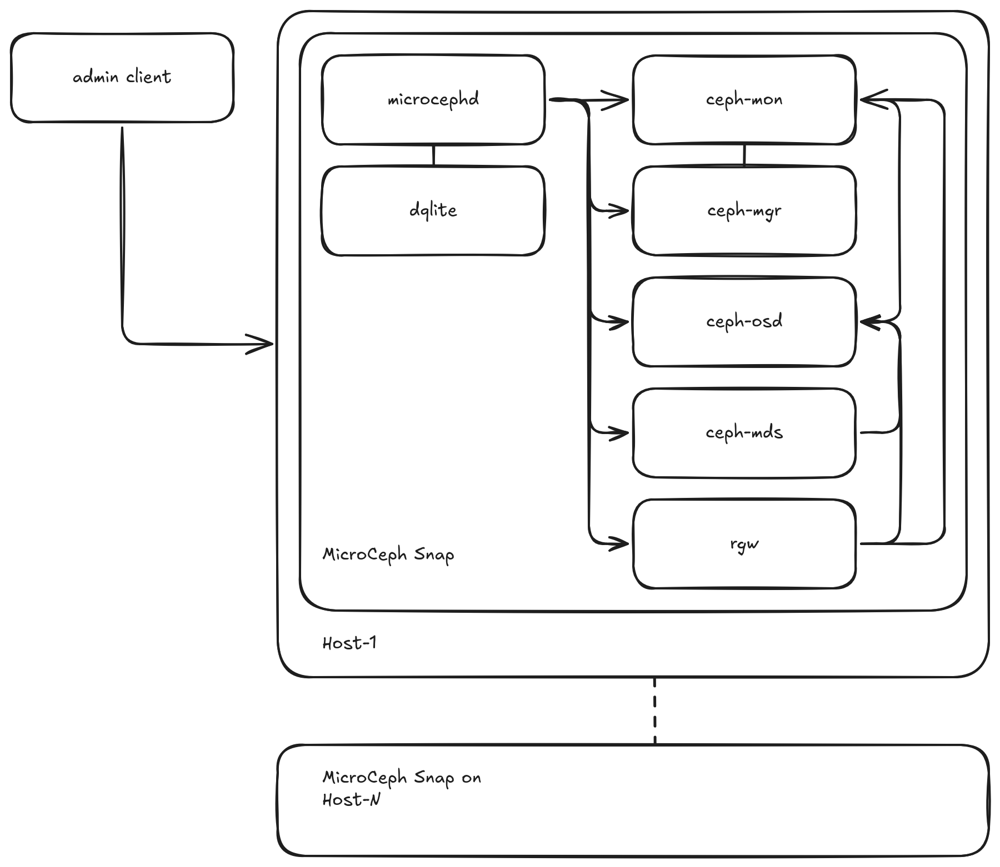

MicroCeph architecture
======================

MicroCeph packages core Ceph daemons (MON, MGR, OSD, and optionally RGW, MDS)
into a single snap. These daemons are managed by the microcephd service, which
uses a distributed dqlite database for configuration and state. Management is
primarily done via the microceph command-line tool interacting with microcephd,
alongside standard snapd services.

  MicroCeph Architecture Overview

Components
~~~~~~~~~~

* Host System: The underlying Linux operating system where the MicroCeph
  snap is installed.
* MicroCeph Snap: The package containing Ceph daemons, microcephd, and
  management logic. It runs with confinement provided by snapd. Also see
  the `Snap security documentation <https://snapcraft.io/docs/snap-explanation#p-111647-security>`_
  for details.  
* microcephd: The core service (based on Microcluster) responsible for managing the
  MicroCeph cluster state, coordinating actions across nodes (if clustered), and managing
  the Ceph daemons within the snap.  
* dqlite Database: A distributed SQLite database used by microcephd to store cluster
  configuration, node status, and other metadata.   
* microceph CLI: The primary tool used by administrators to interact with microcephd
  for managing MicroCeph instances.  
* Ceph Daemons (within the snap):  

  * ceph-mon: Ceph Monitor (MON) daemon(s).  
  * ceph-mgr: Ceph Manager (MGR) daemon(s), providing access to management
    APIs and modules like the Dashboard.  
  * ceph-osd: Ceph Object Storage Daemons (OSDs), managing data on underlying storage devices.  
  * ceph-radosgw (optional): RGW (object-storage S3/Swift gateway) service.  
  * ceph-mds (optional): Metadata Server (MDS) daemons for CephFS.  

* Client Workloads: Consume Ceph storage via RBD block devices, RGW object buckets,
  or CephFS shared filesystems.

