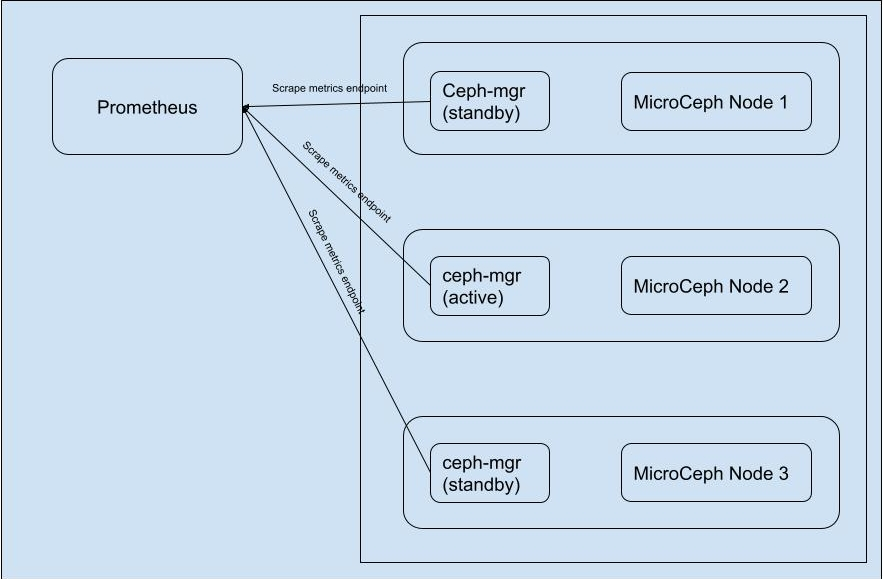

Enable MicroCeph metrics collection with Prometheus
===================================================

Introduction
------------

Metrics play an important role in understanding why your MicroCeph deployment is working in certain ways. This is important if you wish serve dependable storage services. Metrics or Mesurements are vital operation state samples which becomes the foundation for subsequent analysis of your cluster's behaviour.

A popular and mature open-source tool used for scraping and recording metrics over time is Prometheus. Ceph is also designed to be easily integrateable with Prometheus. This tutorial documents the procedure and related information for configuring Prometheus to scrape MicroCeph's metrics endpoint.

Setup
-----

  Prometheus service scraping endpoints of a multi-node MicroCeph cluster.

The diagram above describes how the metrics endpoint is served by ceph-mgr and scraped by Prometheus on a service level. Another thing to notice is that at any given time only one of the mgr module is active and responsible for receiving MgrReports and serving them i.e. only one instance of ceph-mgr serves the metrics endpoint. As the active Mgr instance can be changing over time, standard practice is to scrape all the mgr instances when monitoring a Ceph cluster.

Enabling Ceph-Mgr Prometheus module
~~~~~~~~~~~~~~~~~~~~~~~~~~~~~~~~~~~

Ceph-Mgr prometheus module is responsible for serving the metrics endpoint which can then be scraped by Prometheus itself. We can enable the module by executing the following command on a MicroCeph node:

..  code-block:: none

    ceph mgr module enable prometheus

Configuring metrics endpoint
~~~~~~~~~~~~~~~~~~~~~~~~~~~~

By default, it will accept HTTP requests on port 9283 on all IPv4 and IPv6 addresses on the host. However this can configured using the following ceph-mgr config keys to fine tune to requirements.

..  code-block:: none

    ceph config set mgr mgr/prometheus/server_addr <addr>
    ceph config set mgr mgr/prometheus/port <port>

For details on how metrics endpoint can be further configured visit `Ceph Prometheus module <https://docs.ceph.com/en/quincy/mgr/prometheus/>`_

Configuring Prometheus to scrape MicroCeph
------------------------------------------

Prometheus uses yaml file based configuration of scrape targets. While Prometheus supports an extensive list of configurations that is out of the scope of this document. For details visit `Prometheus configuration <https://prometheus.io/docs/prometheus/latest/configuration/configuration/>`_

A simple configuration file is provided below:

..  code-block:: yaml

    # microceph.yaml
    global:
    external_labels:
        monitor: 'microceph-demo'

    # Scrape Job
    scrape_configs:
    - job_name: 'microceph'

        # Ceph's default for scrape_interval is 15s.
        scrape_interval: 15s

        # List of all the ceph-mgr instances along with default (or configured) port.
        static_configs:
        - targets: ['10.245.165.103:9283', '10.245.165.205:9283', '10.245.165.94:9283']

Start Prometheus with provided configuration file.

..  code-block:: none

    prometheus --config.file=microceph.yaml

The default port used is 9090 hence collected metrics can be observed at <prometheus_addr>:9090 as:

.. figure:: assets/prometheus_console.jpg

  A Prometheus console displaying scraped metric from MicroCeph cluster.
