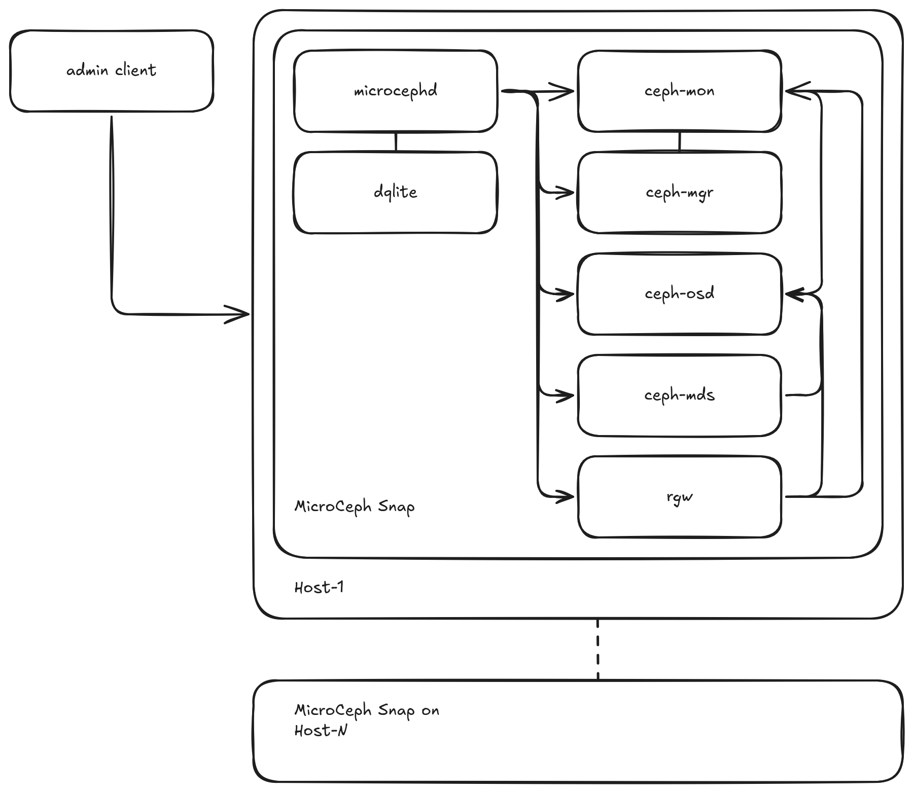

.. _microceph-architecture:

MicroCeph architecture
======================

MicroCeph packages core Ceph daemons (MON, MGR, OSD, and optionally RGW, MDS)
into a single snap. These daemons are managed by the microcephd service, which
uses a distributed `dqlite`_ database for configuration and state. Management is
primarily done via the microceph command-line tool interacting with microcephd,
alongside standard snapd services.

  MicroCeph Architecture Overview

Components
----------

* Host System: The underlying Linux operating system where the MicroCeph
  snap is installed.
* MicroCeph Snap: The package containing Ceph daemons, microcephd, and
  management logic. It runs with confinement provided by snapd. See
  the `snap security confinement documentation`_ to learn more about snap security and isolation.
* microcephd: The core service (based on `Microcluster`_) responsible for managing the
  MicroCeph cluster state, coordinating actions across nodes (if clustered), and managing
  the Ceph daemons within the snap.  
* dqlite Database: A distributed SQLite database used by microcephd to store cluster
  configuration, node status, and other metadata.   
* microceph CLI: The primary tool used by administrators to interact with microcephd
  for managing MicroCeph instances.  
* Ceph Daemons (within the snap):  

  * `ceph-mon`_: Ceph Monitor (MON) daemon(s), maintaining cluster state and consensus.
  * `ceph-mgr`_: Ceph Manager (MGR) daemon(s), providing access to management APIs and modules like the Dashboard.  
  * `ceph-osd`_: Ceph object storage daemons (OSDs), managing data on underlying storage devices.  
  * `ceph-radosgw`_ (optional): Ceph Object Gateway (RGW) service, providing S3/Swift-compatible object storage.  
  * `ceph-mds`_ (optional): Metadata Server (MDS) daemons for CephFS.  

* Client Workloads: Consume Ceph storage via RBD block devices, RGW object buckets,
  or CephFS shared filesystems.

.. LINKS
.. _dqlite: https://canonical.com/dqlite/docs/
.. _snap security confinement documentation: https://snapcraft.io/docs/explanation/security/snap-confinement/#explanation-security-snap-confinement
.. _Microcluster: https://github.com/canonical/microcluster
.. _ceph-mon: https://docs.ceph.com/en/latest/man/8/ceph-mon/
.. _ceph-mgr: https://docs.ceph.com/en/latest/mgr/
.. _ceph-osd: https://docs.ceph.com/en/latest/man/8/ceph-osd/
.. _ceph-radosgw: https://docs.ceph.com/en/latest/radosgw/
.. _ceph-mds: https://docs.ceph.com/en/latest/man/8/ceph-mds/

