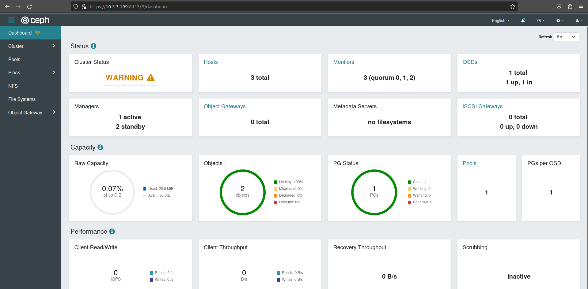
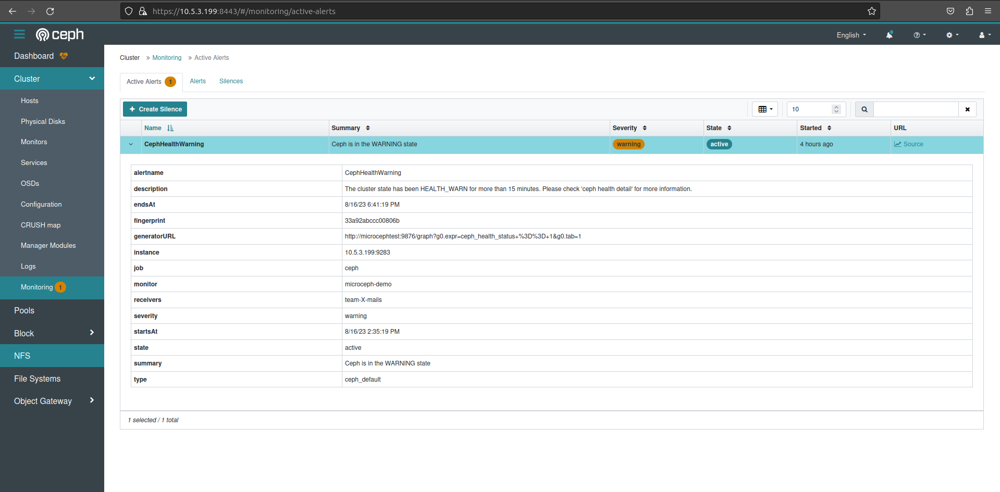

Enable Ceph-Dashboard
=====================

Introduction
------------

Ceph-Dashboard is a built-in web based application for monitoring and management of your Ceph cluster. This makes it easy to administer Ceph clusters for users who prefer WebUI over CLI. It is implemented as a ceph-mgr module and thus is served by the active ceph-mgr daemon.

Enabling Ceph-Dashboard
-----------------------

Ceph-Dashboard can be enabled like any other ceph-mgr module using the ceph cli as:

..  code-block:: none

    ceph mgr module enable dashboard

It can also generate a self signed certificate to quickly configure TLS.

..  code-block:: none

    ceph dashboard create-self-signed-cert

Configure SSL Key/Certificate pair
----------------------------------

Users may wish to configure their own set of SSL certificates for ceph-dashboard. This can be done simply using the ceph cli command:

..  code-block:: none

    ceph dashboard set-ssl-certificate -i server.pem 
    SSL certificate updated
    ceph dashboard set-ssl-certificate-key -i server.key
    SSL certificate key updated

For more details on SSL/TLS config visit `Ceph-Dashboard configuration <https://docs.ceph.com/en/quincy/mgr/dashboard/#configuration>`_.

..  caution::

    MicroCeph snap is a confined ceph application, therefore it does not have access to files at arbitrary locations on the host machine. Therefore, it is required to have the SSL certificate/key files at $HOMEDIR, since MicroCeph can read files located at the home directory. 

Check active dashboard service URL
----------------------------------

Enabled ceph-mgr services can be queried as:

..  code-block:: none

    ceph mgr services
    {
        "dashboard": "https://10.5.3.199:8443/",
        "prometheus": "http://10.5.3.199:9283/"
    }

Creating Admin user
-------------------

..  code-block:: none

    ceph dashboard ac-user-create <username> -i <file-containing-password> administrator

..  caution::

    Since MicroCeph can only acces external files located at $HOMEDIR, <file-containing-password> should also be located at the home directory.

Let's visit the service URL and see our dashboard.

  Ceph Dashboard WebUI

Integration with Prometheus and Alertmanager
--------------------------------------------

Ceph-Dashboard can be configured as a receiver of the alerts coming from the Alertmanager instance. For this, we need to configure both Prometheus and Alertmanager host APIs in ceph dashboard as:

..  code-block:: none

    ceph dashboard set-alertmanager-api-host <alertmanager-host:port>
    ceph dashboard set-prometheus-api-host <prometheus-host:port>

for example:

..  code-block:: none

    ceph dashboard set-alertmanager-api-host 'http://localhost:9093'
    ceph dashboard set-prometheus-api-host 'http://localhost:9090'

Note:
If SSL/TLS is not configured for Prometheus or Alertmanager, ssl verification can be disabled using:

..  code-block:: none

    ceph dashboard set-prometheus-api-ssl-verify False
    ceph dashboard set-alertmanager-api-ssl-verify False

Let's check if the dashboard is receiving alerts!

  We have an active ‘CephHealthWarning’ alert with a description which states that the cluster state has been in HEALTH_WARN for more than 15 minutes.

